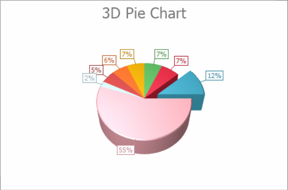

<!-- default badges list -->

<!-- default badges end -->

# Chart for WinForms - Create a 3D Pie Chart

The following example creates a [3D Pie](https://docs.devexpress.com/WindowsForms/2963/controls-and-libraries/chart-control/series-views/3d-series-views/pie-and-donut-series-views/pie-chart?p=netframework) chart at runtime.

Note that this series view type is associated with the [Simple Diagram 3D](https://docs.devexpress.com/WindowsForms/5911/controls-and-libraries/chart-control/diagram/simple-diagram-3d?p=netframework) type, and you should cast your [diagram](https://docs.devexpress.com/WindowsForms/5778/controls-and-libraries/chart-control/diagram?p=netframework) object to this type, in order to access its specific options.

## Files to Review

<!-- default file list -->
* [Form1.cs](./CS/3DPieChart/Form1.cs) (VB: [Form1.vb](./VB/3DPieChart/Form1.vb))
<!-- default file list end -->

## Documentation

* [Pie Chart](https://docs.devexpress.com/WindowsForms/2963/controls-and-libraries/chart-control/series-views/3d-series-views/pie-and-donut-series-views/pie-chart)
<!-- feedback -->
## Does this example address your development requirements/objectives?

 

(you will be redirected to DevExpress.com to submit your response)
<!-- feedback end -->
